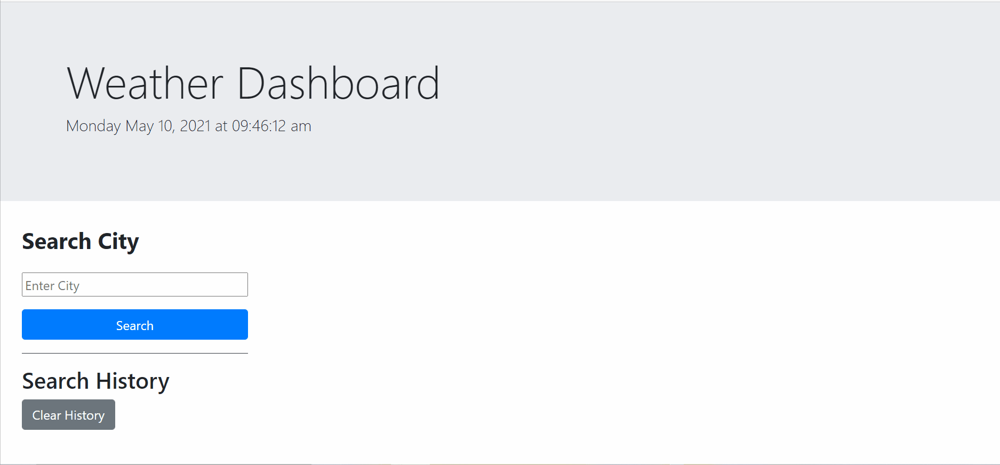

# Server-Side-APIs-Weather-Dashboard
The application is a homework exercise for UW coding Bootcamp.


## Table of Contents 

- [About the application](#about-the-project)
- [Installation](#installation)
- [Usage](#usage)
- [Credit](#credit)
- [License](#license)

## About the application

- The application was develop to solve the following user story:
```
AS A traveler
I WANT to see the weather outlook for multiple cities
SO THAT I can plan a trip accordingly
```

- Built with the following technologies:
    - [Bootstrap](https://getbootstrap.com/) - CSS Framework 
    - [jQuery](https://jquery.com/)
    - [Moments.js](https://momentjs.com/)
    - [OpenWeather One Call API](https://openweathermap.org/api/one-call-api)
    - HTML, CSS, and Javascript


## Installation

- Open [Weather-Dashboard](https://mohamedb-01.github.io/Server-Side-APIs-Weather-Dashboard/) 
- Or, open index.html in the internet browser.

## Usage

- Go to [Deployed Github Page](https://mohamedb-01.github.io/Server-Side-APIs-Weather-Dashboard/)

```
GIVEN a weather dashboard with form inputs
WHEN I search for a city
THEN I am presented with current and future conditions for that city and that city is added to the search history
WHEN I view current weather conditions for that city
THEN I am presented with the city name, the date, an icon representation of weather conditions, the temperature, the humidity, the wind speed, and the UV index
WHEN I view the UV index
THEN I am presented with a color that indicates whether the conditions are favorable, moderate, or severe
WHEN I view future weather conditions for that city
THEN I am presented with a 5-day forecast that displays the date, an icon representation of weather conditions, the temperature, the wind speed, and the humidity
WHEN I click on a city in the search history
THEN I am again presented with current and future conditions for that city
```

Mood Tracker Demo \
 \
\


## Credit

- [Mohamed Bassiouni](https://github.com/MohamedB-01)


## License

The MIT License (MIT)

Copyright (c) 2021 Mohamed Bassiouni

Permission is hereby granted, free of charge, to any person obtaining a copy of this software and associated documentation files (the "Software"), to deal in the Software without restriction, including without limitation the rights to use, copy, modify, merge, publish, distribute, sublicense, and/or sell copies of the Software, and to permit persons to whom the Software is furnished to do so, subject to the following conditions:

The above copyright notice and this permission notice shall be included in all copies or substantial portions of the Software.

THE SOFTWARE IS PROVIDED "AS IS", WITHOUT WARRANTY OF ANY KIND, EXPRESS OR IMPLIED, INCLUDING BUT NOT LIMITED TO THE WARRANTIES OF MERCHANTABILITY, FITNESS FOR A PARTICULAR PURPOSE AND NONINFRINGEMENT. IN NO EVENT SHALL THE AUTHORS OR COPYRIGHT HOLDERS BE LIABLE FOR ANY CLAIM, DAMAGES OR OTHER LIABILITY, WHETHER IN AN ACTION OF CONTRACT, TORT OR OTHERWISE, ARISING FROM, OUT OF OR IN CONNECTION WITH THE SOFTWARE OR THE USE OR OTHER DEALINGS IN THE SOFTWARE.